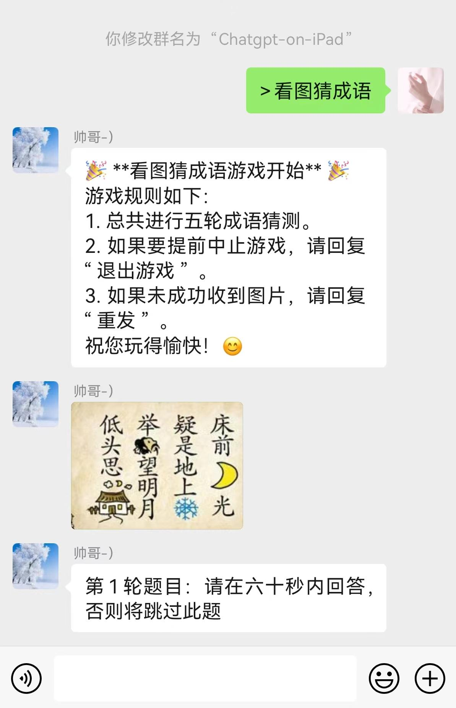

# 简介

> chatgpt-on-wechat-ipad （简称CoW）修改于chatgpt-on-wechat ，底层将itchat替换为ipad协议版本。更安全和更普遍，并魔改很多功能
> 项目是基于大模型的智能对话机器人，支持微信公众号、企业微信应用、飞书、钉钉接入，可选择GPT3.5/GPT4.0/Claude/Gemini/LinkAI/ChatGLM/KIMI/文心一言/讯飞星火/通义千问/LinkAI，能处理文本、语音和图片，通过插件访问操作系统和互联网等外部资源，支持基于自有知识库定制企业AI应用。

最新版本支持的功能如下：
-  ✅   **具备原COW所有功能并保持更新：** 私聊及群聊的消息智能回复，支持多轮会话上下文记忆，支持 GPT-3.5, GPT-4, GPT-4o, Claude-3, Gemini, 文心一言, 讯飞星火, 通义千问，ChatGLM-4，Kimi(月之暗面)
-  ✅   **插件功能丰富：** 看图猜成语，早报，定时任务，疯狂星期4文案，画图
-  ✅   **图像能力：** 支持图片生成、图片识别、图生图（如照片修复），可选择 Dall-E-3, stable diffusion, replicate, midjourney, CogView-3, vision模型
-  ✅   **丰富插件：** 支持个性化插件扩展，已实现多角色切换、文字冒险、敏感词过滤、聊天记录总结、文档总结和对话、联网搜索，看图猜成语，KFC，早报，热榜等非常多的娱乐插件



## 声明

1. 本项目遵循 [MIT开源协议](/LICENSE)，仅用于技术研究和学习，使用本项目时需遵守所在地法律法规、相关政策以及企业章程，禁止用于任何违法或侵犯他人权益的行为
2. 境内使用该项目时，请使用国内厂商的大模型服务，并进行必要的内容安全审核及过滤
3. 本项目主要接入协同办公平台，请使用公众号、企微自建应用、钉钉、飞书等接入通道，其他通道为历史产物，已不再维护
4. 任何个人、团队和企业，无论以何种方式使用该项目、对何对象提供服务，所产生的一切后果，本项目均不承担任何责任

## 社区

开源项目交流群：


# 🚀 优点
**无需Windows 系统：**  无需Windows环境，Linux即可，可云服务器挂机
**成熟稳定：**  Linux可长期挂机使用，不掉线，不封号，一次扫码，长期在线。
**插件可扩展：**  目前已适配修改大量插件，可定制开发


快速开始详细文档：[项目搭建文档](https://docs.link-ai.tech/cow/quick-start)

## 一、准备

### 1. 账号注册
申请ipad协议账号，免费试用3天，首月10，次月20
### 2.运行环境

支持 Linux、MacOS、Windows 系统（可在Linux服务器上长期运行)，同时需安装 `Python`。
> 建议Python版本在 3.7.1~3.9.X 之间，推荐3.8版本，3.10及以上版本在 MacOS 可用，其他系统上不确定能否正常运行。


**(1) 克隆项目代码：**

```bash
git clone https://github.com/azz212/chatgpt-on-wechat-ipad
cd chatgpt-on-wechat-ipad/
```

**(2) 安装核心依赖 (必选)：**
> 注意需要申请ipad协议token，否则无法运行。也可以用其他的http服务版的协议，自己修改底层实现
```bash
pip3 install -r requirements.txt
```

**(3) 拓展依赖 (可选，建议安装)：**

```bash
pip3 install -r requirements-optional.txt
```
> 如果某项依赖安装失败可注释掉对应的行再继续

## 二、配置

配置文件的模板在根目录的`config-template.json`中，需复制该模板创建最终生效的 `config.json` 文件：

```bash
  cp config-template.json config.json
```

然后在`config.json`中填入配置，以下是对默认配置的说明，可根据需要进行自定义修改（注意实际使用时请去掉注释，保证JSON格式的完整）：

```bash
# config.json文件内容示例
{
  "model": "gpt-3.5-turbo",                                   # 模型名称, 支持 gpt-3.5-turbo, gpt-4, gpt-4-turbo, wenxin, xunfei, glm-4, claude-3-haiku, moonshot
  "open_ai_api_key": "YOUR API KEY",                          # 如果使用openAI模型则填入上面创建的 OpenAI API KEY
  "proxy": "",                                                # 代理客户端的ip和端口，国内环境开启代理的需要填写该项，如 "127.0.0.1:7890"
  "single_chat_prefix": ["bot", "@bot"],                      # 私聊时文本需要包含该前缀才能触发机器人回复
  "single_chat_reply_prefix": "[bot] ",                       # 私聊时自动回复的前缀，用于区分真人
  "group_chat_prefix": ["@bot"],                              # 群聊时包含该前缀则会触发机器人回复
  "group_name_white_list": ["ChatGPT测试群", "ChatGPT测试群2"], # 开启自动回复的群名称列表
  "group_chat_in_one_session": ["ChatGPT测试群"],              # 支持会话上下文共享的群名称  
  "image_create_prefix": ["画", "看", "找"],                   # 开启图片回复的前缀
  "conversation_max_tokens": 1000,                            # 支持上下文记忆的最多字符数
  "speech_recognition": false,                                # 是否开启语音识别
  "group_speech_recognition": false,                          # 是否开启群组语音识别
  "voice_reply_voice": false,                                 # 是否使用语音回复语音
  "character_desc": "你是基于大语言模型的AI智能助手，旨在回答并解决人们的任何问题，并且可以使用多种语言与人交流。",  # 人格描述
  # 订阅消息，公众号和企业微信channel中请填写，当被订阅时会自动回复，可使用特殊占位符。目前支持的占位符有{trigger_prefix}，在程序中它会自动替换成bot的触发词。
  "subscribe_msg": "感谢您的关注！\n这里是ChatGPT，可以自由对话。\n支持语音对话。\n支持图片输出，画字开头的消息将按要求创作图片。\n支持角色扮演和文字冒险等丰富插件。\n输入{trigger_prefix}#help 查看详细指令。",
  "use_linkai": false,                                        # 是否使用LinkAI接口，默认关闭，开启后可国内访问，使用知识库和MJ
  "linkai_api_key": "",                                       # LinkAI Api Key
  "linkai_app_code": ""                                       # LinkAI 应用code
}
```
**配置说明：**

**1.个人聊天**

+ 个人聊天中，需要以 "bot"或"@bot" 为开头的内容触发机器人，对应配置项 `single_chat_prefix` (如果不需要以前缀触发可以填写  `"single_chat_prefix": [""]`)
+ 机器人回复的内容会以 "[bot] " 作为前缀， 以区分真人，对应的配置项为 `single_chat_reply_prefix` (如果不需要前缀可以填写 `"single_chat_reply_prefix": ""`)

**2.群组聊天**

+ 群组聊天中，群名称需配置在 `group_name_white_list ` 中才能开启群聊自动回复。如果想对所有群聊生效，可以直接填写 `"group_name_white_list": ["ALL_GROUP"]`
+ 默认只要被人 @ 就会触发机器人自动回复；另外群聊天中只要检测到以 "@bot" 开头的内容，同样会自动回复（方便自己触发），这对应配置项 `group_chat_prefix`
+ 可选配置: `group_name_keyword_white_list`配置项支持模糊匹配群名称，`group_chat_keyword`配置项则支持模糊匹配群消息内容，用法与上述两个配置项相同。（Contributed by [evolay](https://github.com/evolay))
+ `group_chat_in_one_session`：使群聊共享一个会话上下文，配置 `["ALL_GROUP"]` 则作用于所有群聊

**3.语音识别**

+ 添加 `"speech_recognition": true` 将开启语音识别，默认使用openai的whisper模型识别为文字，同时以文字回复，该参数仅支持私聊 (注意由于语音消息无法匹配前缀，一旦开启将对所有语音自动回复，支持语音触发画图)；
+ 添加 `"group_speech_recognition": true` 将开启群组语音识别，默认使用openai的whisper模型识别为文字，同时以文字回复，参数仅支持群聊 (会匹配group_chat_prefix和group_chat_keyword, 支持语音触发画图)；
+ 添加 `"voice_reply_voice": true` 将开启语音回复语音（同时作用于私聊和群聊）

**4.其他配置**

+ `model`: 模型名称，目前支持 `gpt-3.5-turbo`, `gpt-4o`, `gpt-4-turbo`, `gpt-4`, `wenxin` , `claude` , `gemini`, `glm-4`,  `xunfei`, `moonshot`
+ `temperature`,`frequency_penalty`,`presence_penalty`: Chat API接口参数，详情参考[OpenAI官方文档。](https://platform.openai.com/docs/api-reference/chat)
+ `proxy`：由于目前 `openai` 接口国内无法访问，需配置代理客户端的地址，详情参考  [#351](https://github.com/zhayujie/chatgpt-on-wechat/issues/351)
+ 对于图像生成，在满足个人或群组触发条件外，还需要额外的关键词前缀来触发，对应配置 `image_create_prefix `
+ 关于OpenAI对话及图片接口的参数配置（内容自由度、回复字数限制、图片大小等），可以参考 [对话接口](https://beta.openai.com/docs/api-reference/completions) 和 [图像接口](https://beta.openai.com/docs/api-reference/completions)  文档，在[`config.py`](https://github.com/zhayujie/chatgpt-on-wechat/blob/master/config.py)中检查哪些参数在本项目中是可配置的。
+ `conversation_max_tokens`：表示能够记忆的上下文最大字数（一问一答为一组对话，如果累积的对话字数超出限制，就会优先移除最早的一组对话）
+ `rate_limit_chatgpt`，`rate_limit_dalle`：每分钟最高问答速率、画图速率，超速后排队按序处理。
+ `clear_memory_commands`: 对话内指令，主动清空前文记忆，字符串数组可自定义指令别名。
+ `hot_reload`: 程序退出后，暂存等于状态，默认关闭。
+ `character_desc` 配置中保存着你对机器人说的一段话，他会记住这段话并作为他的设定，你可以为他定制任何人格      (关于会话上下文的更多内容参考该 [issue](https://github.com/zhayujie/chatgpt-on-wechat/issues/43))
+ `subscribe_msg`：订阅消息，公众号和企业微信channel中请填写，当被订阅时会自动回复， 可使用特殊占位符。目前支持的占位符有{trigger_prefix}，在程序中它会自动替换成bot的触发词。

**5.LinkAI配置 (可选)**

+ `use_linkai`: 是否使用LinkAI接口，开启后可国内访问，使用知识库和 `Midjourney` 绘画, 参考 [文档](https://link-ai.tech/platform/link-app/wechat)
+ `linkai_api_key`: LinkAI Api Key，可在 [控制台](https://link-ai.tech/console/interface) 创建
+ `linkai_app_code`: LinkAI 应用code，选填

**本说明文档可能会未及时更新，当前所有可选的配置项均在该[`config.py`](https://github.com/zhayujie/chatgpt-on-wechat/blob/master/config.py)中列出。**

## 三、运行

### 1.本地运行

如果是开发机 **本地运行**，直接在项目根目录下执行：

```bash
python3 app.py                                    # windows环境下该命令通常为 python app.py
```


### 2.服务器部署

使用nohup命令在后台运行程序：

```bash
nohup python3 app.py & tail -f nohup.out          # 在后台运行程序并通过日志输出二维码
```
或者用Supervisor 后台运行，更容易管理
> **多账号支持：** 将项目复制多份，分别启动程序，用不同账号扫码登录即可实现同时运行。

> **特殊指令：** 用户向机器人发送 **#reset** 即可清空该用户的上下文记忆。

感谢原项目作者，如果itchat可以用的话，不用下载本项目

